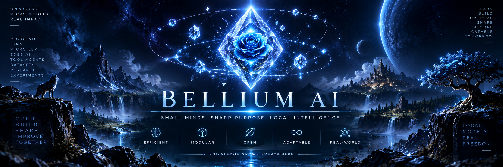

<p align="center">
  
</p>

# Bellium AI

> **Small minds. Sharp purpose. Local intelligence.**

Bellium AI is an open-source laboratory for **micro-NN, k-NN, micro-LLM and hybrid specialist intelligence**. It exists to solve bounded, recurring problems with small measurable models, without calling a large general-purpose model for everything.

Bellium does not wait for AGI, ASI, or one mind that claims to do it all. Intelligence here is a **local mesh of ultra-specialized nodes**. Each module owns one precise task. An orchestration layer routes, adapts and composes those specialists. It does not replace them, and it is not a hidden general mind: when no node fits, the system abstains or escalates.

🌹 **Visual identity:** abyssal blue, crystalline intelligence and a blue rose at the core — a small touch of fantasy and mystery.

## Creator's note

I am Sylvain Galliez (RapideCastor), the creator of Bellium AI.

I do not treat AGI or ASI as the architecture we should wait for. For useful local work, it is enough to ultra-specialize each AI module or node: one task, small enough to measure, allowed to abstain.

That is an engineering bet, not a claim that a large general model is never useful. The hard part is composition: routing, contracts, conflicts, abstention, escalation. An orchestration AI should choose, adapt and compose those nodes. It should not become a hidden general mind, and it should not pretend the mesh covers every new job. Outside a node's contract, the honest answer is no. A large model remains a last resort, not the design.

*On n'a pas besoin d'AGI ni d'ASI comme architecture. Ultra-spécialiser chaque nœud local suffit pour beaucoup de travail utile : une tâche, une mesure, un droit de se taire. L'orchestration compose ces nœuds ; elle ne les remplace pas, et elle n'est pas un esprit général.*

— Sylvain Galliez

## Mission

Use the **smallest competent mechanism** for each task and escalate only when needed.

Priority order when reasonable:

1. deterministic algorithm / classical CV or DSP
2. rules
3. k-NN / nearest exemplars
4. embeddings + k-NN
5. shallow classifier
6. micro-NN
7. specialist micro-LLM
8. compact local general model
9. large local or remote model

The last rungs are fallbacks, not the architecture. A specialist stays local, inspectable and replaceable. Orchestration may adapt *which* node runs and *how* its result is used; it does not dissolve the node into a general model.

Abstention is a feature. Critical safety constraints stay deterministic.

## First project-driven tracks

- selected-zone image filling and compact inpainting
- image cutout / foreground extraction
- white or transparent background normalization
- asset-quality and near-duplicate detection
- language preservation: phonemes, pronunciation and grapheme↔phoneme reconstruction
- tool / skill / workflow routing
- memory reranking and anomaly detection
- robotics and aquaponics visual-state specialists
- StoryCore / game-asset preparation helpers

## Imported specialists

The first migration preserves provenance from `zedarvates/botte-secrete` rather than replacing its live integrations. It includes the existing micro-NN family and the shadow-only Asset Quality k-NN algorithm. Private/local neighbor memories are not published.

See [`docs/MIGRATION_INVENTORY.md`](docs/MIGRATION_INVENTORY.md) and [`docs/ROADMAP.md`](docs/ROADMAP.md).

## Evidence and authority

Every specialist must document its task, provenance, baseline, quality, dangerous false agreements,
abstention and limits before deployment. Current v0 evidence is primarily synthetic; real-data
quality and RAM/VRAM are not established. See [the evaluation protocol](benchmarks/protocols/README.md).

Authority modes are explicit:

`observe → consultative → shadow → active`

Importing or benchmarking a model never silently promotes its authority.

---

> **Bellium AI — a mesh of small specialists, distilled until only the useful signal remains.**

## Install and verify

```sh
python -m pip install .
# Optional Pillow image adapters:
python -m pip install ".[image]"
# Development and unified tests, including the retained published scenarios:
python -m pip install ".[dev]"
python -m ruff check .
python -m pytest -q
python -m build
```

Models are included in the wheel. Test the installed package outside the source
import path with `python -I scripts/smoke_installed.py --image` after installing it.

The tool router is a first orchestration specialist: it proposes which node should
run, and it does not execute the tool itself.

```python
from bellium.specialists.tool_router import route_tool

result = route_tool({"signals": {"mentions_secret": True}})
assert result.output["tool"] == "escalate"
# A proposal is returned; no tool is executed.
```

See [architecture and compatibility](docs/ARCHITECTURE.md) and
[the audit correction record](docs/STABILIZATION.md) for the merged APIs and behavior changes.

The [photographic evaluation](docs/VISUAL_QUALITY_V2.md) now tests an uncertainty
check on known neighboring regions. It reduced severe accepted errors from 7/24
to 0/11 on the same new test cases, but coverage remains below the 80% gate.
Photographic inpainting remains experimental; rejected candidates must not be applied.

The [guard correction](docs/VISUAL_QUALITY_V3.md) fixed a probe bias that caused ten
false rejections, calibrated the guard on synthetic ground truth, and measured a new
photographic lot: 62.5% coverage with no severe accepted error. Coverage stays below
the 80% gate, so photographic inpainting remains consultative and experimental.

The [frozen validation](docs/VISUAL_QUALITY_V4.md) on three never-used photographs
now passes every protocol gate: 83.3% coverage, no accepted error above 25/255 and
0.33 s at p95. Inpainting stays consultative: it proposes a fill, and abstains
outside the local conditions its known-context probes can verify.

## Local specialist snapshot

The first local implementations now live in this working tree:

- 11 imported Botte Secrete micro-NNs, observe-only, with SHA-256 provenance
- native patch k-NN inpainting
- native color k-NN cutout
- native asset-quality k-NN (shadow, no private memory)
- native inpaint-router micro-NN
- white-background hybrid built on the cutout

- native phoneme k-NN and pronunciation similarity

- native tool router (veto + k-NN + micro-NN)
- native memory reranker

- native visual anomaly k-NN (not the imported log detector)

- native grapheme-phoneme k-NN (second wave)

- native cognate retrieval k-NN (second wave)

- native prosody profile k-NN (second wave)

- native panel-safe crop (second wave)

- native speech-bubble region finder (second wave)

- native consistency retrieval k-NN (third wave)

- native flat-color helper (third wave)

- native voice-activity k-NN (third wave)

- native recording-quality k-NN (third wave)

See [docs/SPECIALISTS.md](docs/SPECIALISTS.md). No specialist is active by default.

Fourth wave, game-oriented:

- native texture-repeat and texture-tileability k-NN
- native nano-NN tile-seam classifier with a hard 64-parameter budget
- native sprite-anchor k-NN and bounded sprite frame preparation
- native NPC behaviour micro-NN with deterministic vetoes

See [the model tiers](docs/MODEL_TIERS.md) for the deterministic, k-NN, nano-NN
and micro-NN boundaries, and the nano size contract.

Fifth wave, sprite sheets and action consequences:

- native clip-loop k-NN and a sprite-sheet preparation report
- frame-phase tier measured and deliberately not shipped (the rule wins)
- native consequence precedents, micro-NN and hybrid with a deterministic veto

Sixth wave, physical estimates (P7 first gate):

- published references for gravity, atmosphere, pressure and ballistic previews
- k-NN case interpolation, a four-parameter nano gravity model and a 21-parameter
  micro atmosphere model, measured against the references in
  [the gate record](docs/PHYSICAL_ESTIMATES.md)

Seventh wave, texture grain (P8 first gate):

- native texture-orientation k-NN: grain direction, angle and period, with a perspective
  refusal instead of one global period
- shift-difference period measurement shared with the repeat and axis tests
- held-out distorted-texture measurement in
  [the gate record](docs/TEXTURE_REPEAT_GATE.md)

Eighth wave, animation timing:

- native easing-profile k-NN over the published curves, and a hybrid timing report with
  holds, peak, duplicates and warnings
- no neural tier retained: the measured candidate lost to the published rule
  ([gate record](docs/ANIMATION_TIMING_GATE.md))

Ninth wave, albedo and illumination separation (P8 second gate):

- controlled renders with known maps, a log-domain separation, and a specialist that
  returns both candidates and requires a declared shading prior
- measured finding: an image-only choice is right in 76 % of cases
  ([gate record](docs/MATERIAL_SEPARATION_GATE.md))

Tenth wave, normals from multi-light captures (P8 third gate):

- photometric stereo on controlled captures with declared light directions, per-patch
  trust from the fit residual, and abstention when the Lambertian model fails
- trusted patches at 0.0094 degrees against 7.86 degrees for the rejected ones
  ([gate record](docs/PHOTOMETRIC_NORMALS_GATE.md))

Eleventh wave, direct image editing (P9 first gate):

- seven deterministic filters with adjustable strength, feathered selection masks and a
  replayable edit stack with undo and redo
- magic eraser wiring that reuses the inpaint router and escalates when unsure
- measured 4 to 18 ms per 64 x 64 preview: not interactive yet
  ([gate record](docs/EDITING_GATE.md))

Twelfth wave, interactive editing path:

- vectorised, lookup-table and plain filter backends kept pixel-identical, plus
  area-averaged previews that are never exports
- a preview session at 14.7 ms p95 on a 512 x 512 source, against a cold one-shot
  preview of about 0.5 s ([interactive record](docs/EDITING_INTERACTIVE_GATE.md))

Thirteenth wave, relative height from normals (P8 fourth gate):

- four published integrators compared on controlled geometry, with the row/column average
  as the measured default and the convergence of the least-squares solve reported per call
- a declared grazing floor for capture-derived fields: 1.370 of relative error without one,
  0.194 with one while keeping 96 % of the pixels ([gate record](docs/NORMAL_INTEGRATION_GATE.md))
- a k-NN that names the integrator before anything is integrated: held out at 31 of 32 fields
  against 25 of 32 for the published rule and 23 of 32 for the fixed default

Fourteenth wave, normal maps as pixels (P8 fifth gate):

- 8-bit encode/decode with a mask, the green-channel flip, a displacement quantizer, and a curl
  check returned by every integration
- the handedness is decided by integrability where the surface bends: 8 of 32 readings decided,
  0 decided wrongly, and an exact plane genuinely ambiguous
- the round trip costs 0.08 to 0.25 degrees; storing the map as sRGB colour costs about 42
  ([gate record](docs/NORMAL_MAP_IO_GATE.md))

Fifteenth wave, reducing a normal field (P8 sixth gate):

- three published reductions and a level-of-detail chain that reports the flattening it produces
- the direction of a reduction is the direction of the average, so the naive form differs only in
  the stored length: 3.7021 degrees as stored against 0.1772, with the same 0.1772 of direction
- mean Z drifts 0.09489 over two levels of a sphere against 0.006 for a cone
  ([gate record](docs/NORMAL_RESAMPLE_GATE.md))

Sixteenth wave, ambient occlusion from relief fields (P8 seventh gate):

- horizon-based accessibility in [0.0, 1.0] computed along radial horizon slices from height or normals
- benchmarked on controlled V-grooves, pits, and synthetic surfaces ([gate record](docs/AMBIENT_OCCLUSION_GATE.md))

P4 gate, atlas packing:

- deterministic atlas geometry: bottom-left skyline placement with a padding gutter, a bounded
  page count and a plan that reports unplaced frames instead of shrinking them
- 10 authored cases x 3 methods with 0 invariant violations, measured against the two published
  shelf baselines ([gate record](docs/ATLAS_PACKING_GATE.md))

P4 gate, engine-import validation:

- declared target contracts (godot-4, unity-sprite-atlas, phaser-3-json, generic-regions) with
  findings and JSON manifest mirrors, including the Unity bottom-left rect conversion
- 21 measured runs: 17 ready, 4 abstain, 0 manifest violations, and no engine executed
  ([gate record](docs/ENGINE_IMPORT_GATE.md))

P4 gate, atlas rasterization:

- exact page composition in RGB or RGBA, with a page invariant checker, a minimal deterministic
  PNG writer and its own container inspector
- 5 measured cases: 397312 raw bytes to 184367 PNG bytes, 0 violations and 0 Pillow mismatches
  ([gate record](docs/ATLAS_RASTER_GATE.md))

P4 gate, exact duplicate removal:

- one stored copy per distinct image with a verified alias map, so an animation keeps its frame
  list and the atlas stores fewer bytes; merging is exact by default and a caller may declare a
  bounded per-channel tolerance instead, whose worst measured delta is reported
- mirrored frames store once too: none, flip-x, flip-y and rotate-180 are matched and declared per
  alias, and the output counts them
- 9 measured cases: 108 declared frames to 59 stored, 86592 bytes saved, 0 bound violations, and a
  mirrored walk that redraws exactly ([gate record](docs/ATLAS_DEDUP_GATE.md))

Local [compression research baselines](docs/model-cards/compression-v0.md) now
cover images, byte streams and static/temporal Gaussian splat records. They
compare causal k-NN and an adaptive linear micro-NN against classical codecs,
preserving exact bytes. Real-asset superiority and runtime integration are unproven.

A [complete binary-PLY archive](docs/model-cards/ply-archive-v0.md) keeps every
declared field, including spherical harmonics and unknown scalar columns. On one
25,674-vertex reconstruction it stored 13.64% fewer bytes than the source file
and 7.15% fewer than a bare zlib reference; that measurement is asset-specific.

Its [coverage gate](docs/PLY_COVERAGE_V2.md) adds canonical ASCII files and an
explicit size limit, and records both the assets where it beats a bare zlib and
the four where the fixed packet envelope makes it larger.

A [polygonal gate](docs/PLY_POLYGONAL_V3.md) adds the `vertex` plus `face` layout
most non-splat PLY files use: element-aware byte planes, uniform-arity face
transposition, and bounded list counts. Measured on synthetic meshes; a real
scanned mesh is the next gate.

P10 gate, 2D drafting document:

- native Y-up drawing in mm or in, with layers and exact line, polyline, circle,
  arc and text primitives
- SVG drafting profile and DXF R12 subset that must reconstruct the same document
- five hand-authored fixtures; foreign SVG, splines and empty sheets abstain
- not a pixel tracer and not a CAD kernel ([gate record](docs/DRAFTING_GATE.md))
